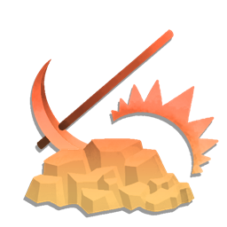
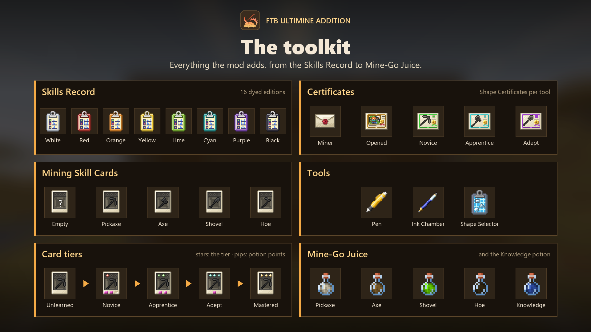

  

# FTB Ultimine Addition { .ua-hero__title }

Ultimine isn't given. It's <em>earned</em>.

An add-on for FTB Ultimine: players unlock the excavation skill by completing mining challenges, one tool and one shape at a time.

[Read the wiki :material-arrow-right:](wiki/index.md){ .md-button .md-button--primary }
[:material-file-document-outline: Docs](docs/index.md){ .md-button }
[:simple-curseforge: Download](https://www.curseforge.com/minecraft/mc-mods/ultimine-addition){ .md-button }
[:fontawesome-brands-github: Source](https://github.com/ixDarkLorD/UltimineAddition){ .md-button }

  
  
  
  
  

  

## The road to Ultimine

-   :material-cards-outline:{ .lg .middle } **Mining Skill Cards**

    ---

    One card per tool: pickaxe, axe, shovel and hoe. Each holds mining challenges, and completing them raises the card from Unlearned to Mastered.

    [:octicons-arrow-right-24: Mining Skill Cards](wiki/mining-skill-cards.md)

-   :material-book-open-variant:{ .lg .middle } **Skills Record**

    ---

    The book that holds your cards, shows their challenges on a pan-and-zoom map, and records your progress with pen and paper.

    [:octicons-arrow-right-24: Skills Record](wiki/skills-record.md)

-   :material-certificate-outline:{ .lg .middle } **Certificates**

    ---

    Shape Certificates teach one Ultimine shape for one tool, for good. The Miner Certificate unlocks every shape with any item.

    [:octicons-arrow-right-24: Unlocking Ultimine](wiki/unlocking-ultimine.md)

-   :material-bottle-tonic-outline:{ .lg .middle } **Mine-Go Juice**

    ---

    A potion brewed from a card's progress: Ultimine with every shape for that card's tool while the effect lasts.

    [:octicons-arrow-right-24: Mine-Go Juice](wiki/unlocking-ultimine.md#mine-go-juice)

-   :material-undo-variant:{ .lg .middle } **Ultimine undo**

    ---

    Press ++ctrl+z++ after an Ultimine to preview putting the blocks back, and again to confirm. The drops and experience are taken back.

    [:octicons-arrow-right-24: Ultimine Undo](wiki/undo.md)

-   :material-tune-variant:{ .lg .middle } **Made for modpacks**

    ---

    Challenges are data pack files, card types can be added from the config folder, and nearly every number is a server setting.

    [:octicons-arrow-right-24: Configuration](wiki/packs/configuration.md)

## The items

{ loading=lazy }

## Versions and loaders

| Minecraft | NeoForge | Forge | Fabric | Source |
|---|:-:|:-:|:-:|---|
| **26.1.2** | :material-check: | – | :material-check: | [`26.1.2`](https://github.com/ixDarkLorD/UltimineAddition/tree/26.1.2) |
| **1.21.1** | :material-check: | – | :material-check: | [`1.21.1`](https://github.com/ixDarkLorD/UltimineAddition/tree/1.21.1) |
| **1.20.1** | – | :material-check: | :material-check: | [`1.20.1`](https://github.com/ixDarkLorD/UltimineAddition/tree/1.20.1) |

Older versions (1.21, 1.19.2, 1.18.2) are discontinued and get no more updates.

!!! note "About these pages"
    The pages describe the current releases on the three supported versions, which share the same features.
