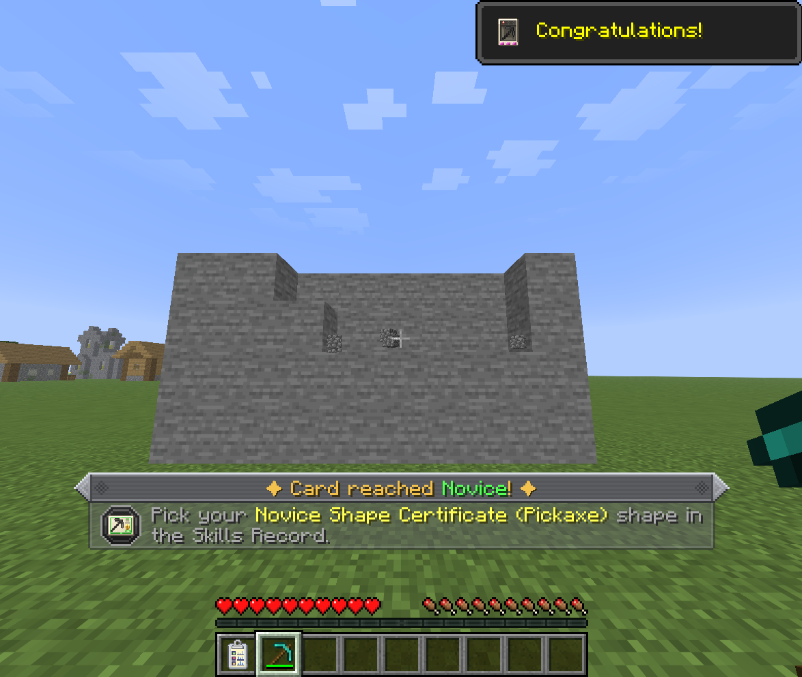

# Mining Skill Cards

A Mining Skill Card records your skill with one tool. There are four built in (pickaxe, axe, shovel and hoe), and packs can [add more](packs/custom-cards.md).

## Getting a card

1.  Craft a **Mining Skill Card: Empty**: five papers, with copper, iron or coal on top, a log and dirt at the sides, and seeds at the bottom.
2.  Craft the empty card with a tool to make that tool's card. Any pickaxe, axe, shovel or hoe works.

A new card is **Unlearned**. Put it in a [Skills Record](skills-record.md) to discover its challenges.

## Tiers

| Tier | Stars on the card | What reaching it gives |
|---|---|---|
| Unlearned | none | – |
| Novice | red | A [Shape Certificate](unlocking-ultimine.md#shape-certificates) pick |
| Apprentice | green | A Shape Certificate pick |
| Adept | teal | A Shape Certificate pick |
| Mastered | gold | A Shape Certificate pick, and the card can go into the Miner Certificate |

The card's texture shows its tier as stars along the top. The strip along the bottom holds its **potion points** as pips, one per point the tier holds, filled while the point is left. They are spent on [Mine-Go Juice](unlocking-ultimine.md#mine-go-juice).

## Challenges

Each tier gives the card a set of challenges for its tool, picked at random from the ones [the data packs define](packs/challenges.md). A challenge asks for an action on certain blocks a number of times:

- **Break** blocks (any tool the card accepts).
- **Strip** logs with an axe.
- **Flatten** blocks into paths with a shovel.
- **Till** blocks with a hoe.

Completing every challenge of the tier raises the card to the next one, with a new set.

{ .ua-shot loading=lazy }

Things worth knowing:

- **Placed blocks don't count.** A block that a player or another entity placed is ineligible, so challenges can't be farmed by placing and breaking. Blocks an [undo](undo.md) puts back are ineligible too.
- **Consume challenges** are marked in the card viewer: they only progress with the Skills Record's consume mode on, and the blocks' drops are used up.
- **Streaks**: challenge blocks done in quick succession build a streak, and every few blocks in it count one extra point.
- **Lucky finds**: now and then a challenge block counts double.
- **Rerolls**: a challenge you haven't started can be swapped for another, a limited number of times per tier, for some of the pen's ink.

How many challenges a tier has, the streak and lucky-find numbers, and the reroll limits are all [server settings](packs/configuration.md).

## A Mastered card

A Mastered card has no more challenges. It is one of the four ingredients of the Miner Certificate, and while the `mastered_effect` server setting is on, simply carrying it grants Ultimine for its tool.
