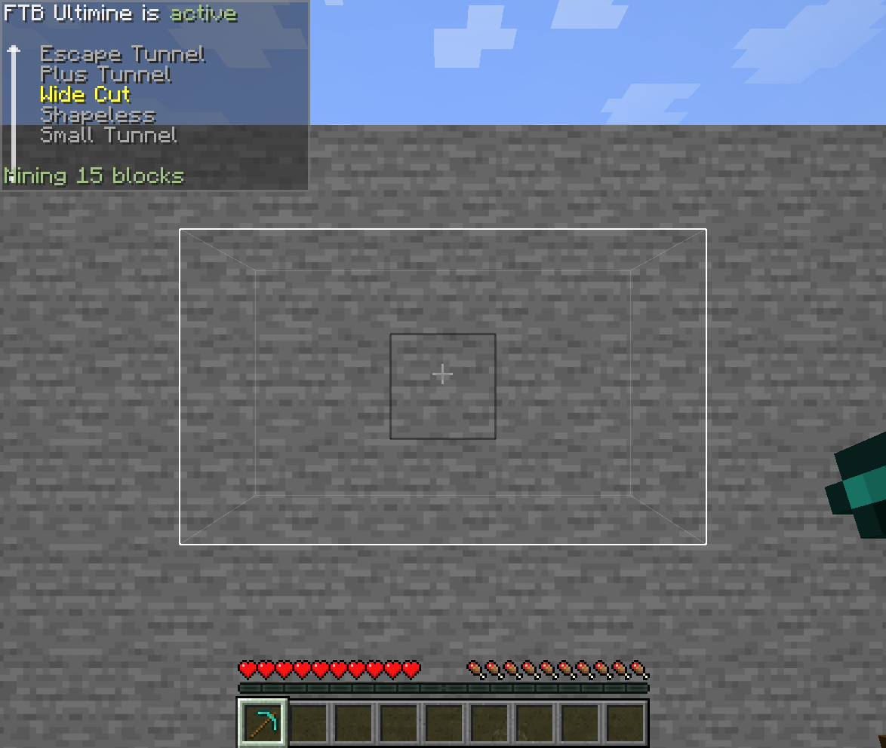

# Ultimine Shapes

A data pack can add its own Ultimine shapes. They join FTB Ultimine's shape list like the built-in ones: players cycle to them with the Ultimine key held, Shape Certificates can teach them, and the Skills Record draws their diagram by itself.

!!! info "Since"
    FTB Ultimine Addition **26.1.2-5**, **2101.2.0.4** (1.21.1) and **2001.2.0.4** (1.20.1).

## Where they go

```
data/<namespace>/ultimine_shapes/<name>.json
```

The shape's id is `<namespace>:<name>`. Shapes load with the data pack, so `/reload` picks up changes, and the server sends its list to every player.

## Drawing a shape

The simplest way is a **pattern**: the blocks as you see them when you face the block you break.

```json title="data/mypack/ultimine_shapes/wide_cut.json"
{
  "name": "Wide Cut",
  "pattern": [
    "#####",
    "##o##",
    "#####"
  ]
}
```

| Character | Meaning |
|---|---|
| `o` | The block you break. Without one, the middle of the pattern is used. |
| `#` | A block of the shape. |
| anything else | Nothing. Use `.` or a space. |

{ .ua-shot loading=lazy }

## Listing blocks

For shapes that reach into the wall, list the blocks as `[right, up, depth]` offsets from the block you break. Depth counts into the block, away from you.

```json title="data/mypack/ultimine_shapes/plus_tunnel.json"
{
  "name": "Plus Tunnel",
  "blocks": [[0, 1, 0], [0, -1, 0], [1, 0, 0], [-1, 0, 0]],
  "repeat": "depth"
}
```

A shape can have a `pattern`, `blocks`, or both. The block you break is always part of it.

## The fields

| Field | Meaning |
|---|---|
| `name` | The name shown to players. Optional: without it the shape uses the translation key `ftbultimine.shape.<namespace>.<name>`, for a resource pack to translate. |
| `pattern` | Rows of the shape, top to bottom, facing the block. Up to 65 × 65. |
| `blocks` | `[right, up, depth]` offsets, each from -32 to 32. |
| `repeat` | `"none"` (the default) or `"depth"`: take the same blocks again one step deeper, over and over, until the block limit. That makes a tunnel. |

## How a shape behaves

- **Only matching blocks are taken**, as with FTB Ultimine's own shapes: the blocks must match the one you break.
- **Nearest blocks first.** When the player's block limit is lower than the shape, the blocks closest to the one you break are taken.
- **A tunnel stops** at the block limit, or at the first layer where nothing matches.
- **On a floor or ceiling**, "up" in the shape is the direction you face.
- A file with a mistake is skipped, and the server log says what is wrong with it.

## Offering a shape to players

A new shape is in the list, but under the default rules players only use the shapes they have learned. Add its id to one of the certificate lists in the [server settings](configuration.md#progression), for example `progression.adept_certificate_shapes`, or let `progression.extra_shapes_certificate` hand out every shape no list names.

The Miner Certificate and Mine-Go Juice unlock every shape, data pack ones included. `general.blacklisted_shapes` can block one by id.

!!! note "1.20.1"
    On 1.20.1 this mod's screens show the shape's `name`, but FTB Ultimine's own shape display only knows the translation key `ftbultimine.shape.<namespace>:<name>`. Add that key in a resource pack to name the shape there.
