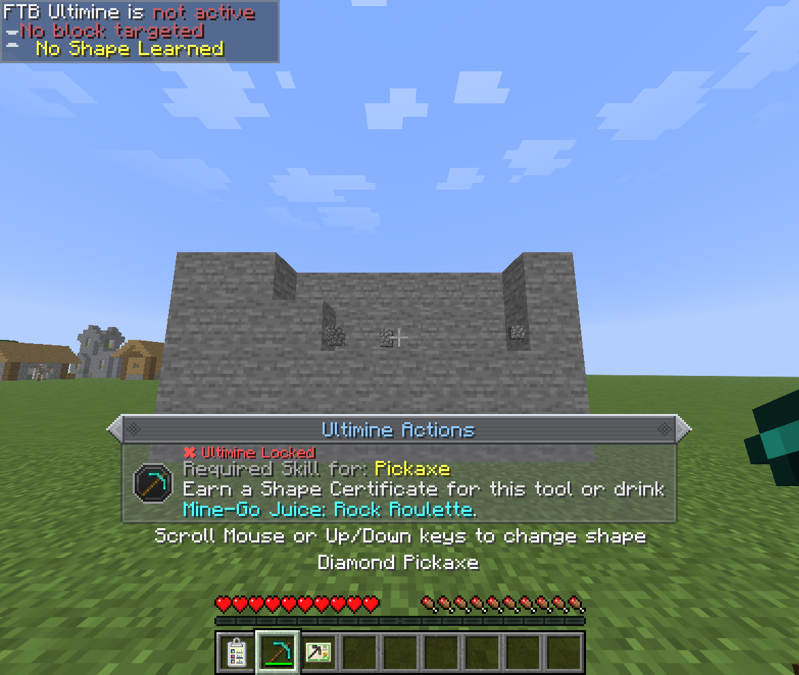
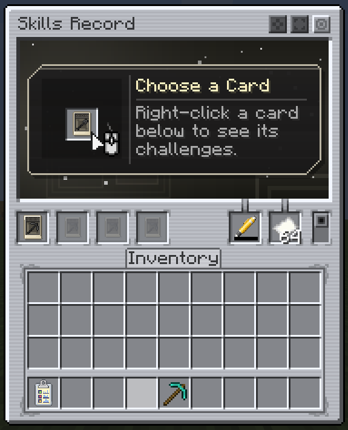
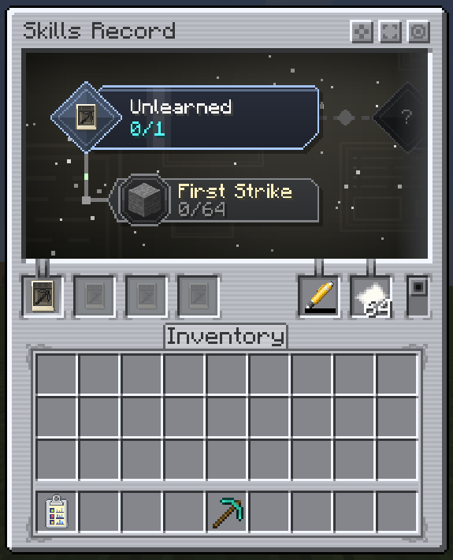
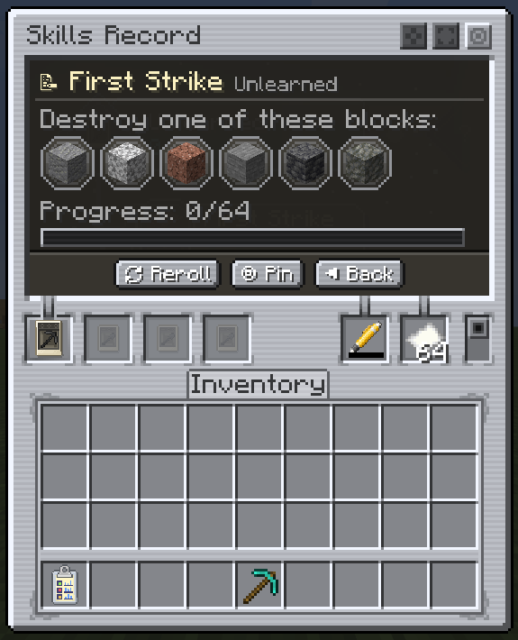
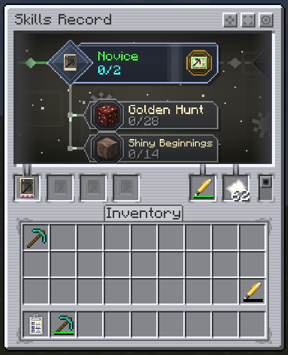
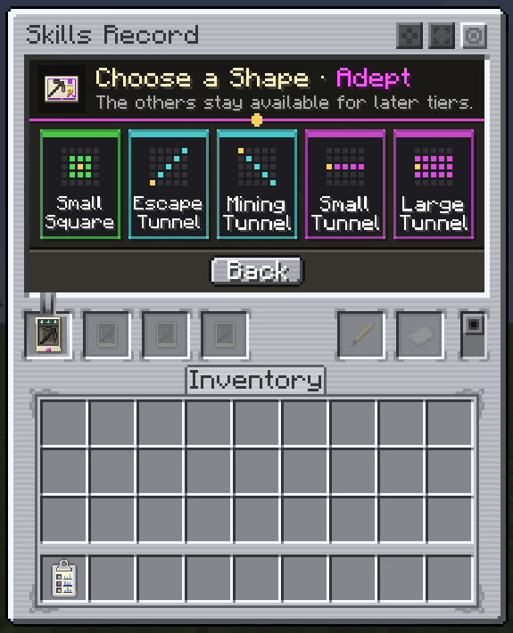
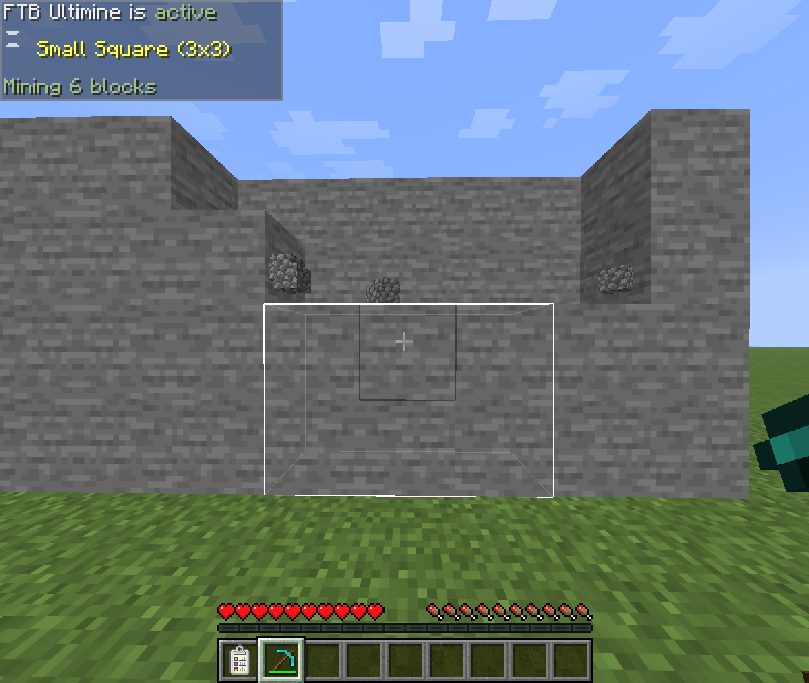
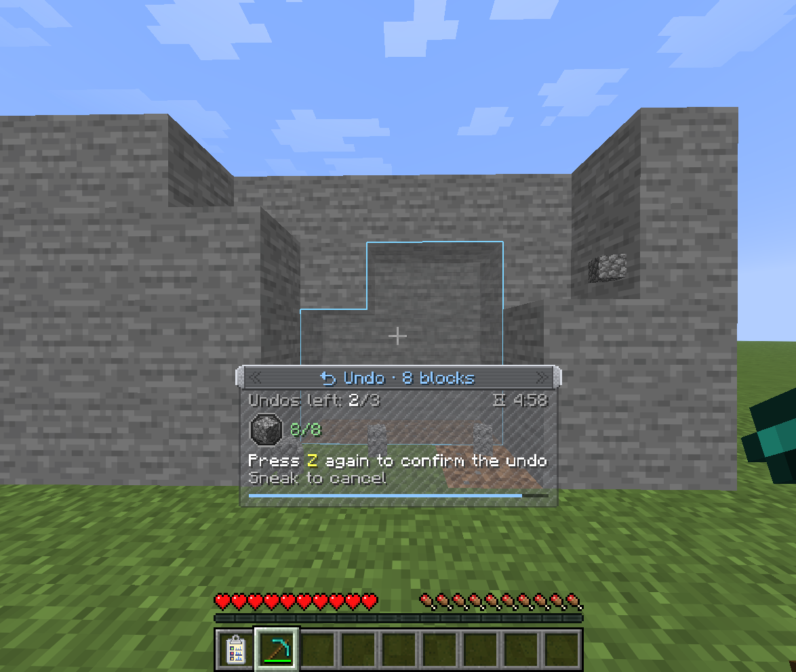

# Walkthrough

Your first Mining Skill Card, from an empty record to your first Ultimine, one step at a time. The screenshots follow a Pickaxe card; the other tools work the same way.

## 1. Find out you can't Ultimine yet

Hold FTB Ultimine's key with a pickaxe in your hand. Nothing gets selected: FTB Ultimine shows **No Shape Learned**, and a notice above the hotbar tells you what the tool needs.

{ .ua-shot loading=lazy }

## 2. Craft what you need

| Item | How |
|---|---|
| **Mining Skill Card: Empty** | Five papers, with copper, iron or coal on top, a log and dirt at the sides, and seeds at the bottom. |
| **Mining Skill Card: Pickaxe** | The empty card crafted with any pickaxe. |
| **Ink Chamber** | Red, green and blue dye in a row, iron ingots and nuggets above and below. |
| **Pen** | The Ink Chamber surrounded by gold ingots, a slime ball and an iron nugget at the corners. |
| **Skills Record** | An empty card between two papers, an iron ingot and two nuggets above, three planks below. |

!!! warning "Fill the Pen"
    A new Pen has no ink, and nothing is recorded without ink. Craft the Pen with dyes to fill it before you start.

## 3. Set up the Skills Record

Use the Skills Record to open it. Put the card in a card slot on the left, and the Pen and some paper in the two slots on the right.

{ .ua-shot .ua-shot--gui loading=lazy }

## 4. Read the card's challenges

Right-click the card in its slot. The viewer above shows the card's tier and the challenges it rolled. A new card is **Unlearned** and has one challenge.

{ .ua-shot .ua-shot--gui loading=lazy }

Click a challenge to see what it wants: the action, the blocks that count and your progress.

{ .ua-shot .ua-shot--gui loading=lazy }

- **Pin** keeps the challenge on your HUD while you play.
- **Reroll** swaps a challenge you haven't started for another one. It costs ink, and each tier allows only a few.

## 5. Do the challenge

Close the record, keep it in your inventory, and do what the challenge asks with the card's tool. Here that means mining stone with a pickaxe.

Three rules decide whether a block counts:

- The record must be **on you**, with the card, an inked Pen and paper inside.
- The block must be **natural**. Blocks placed by a player or another entity don't count.
- A **consume** challenge only counts with the record's consume mode switched on.

Mine quickly and your streak adds bonus points, and now and then a lucky find counts double.

## 6. Tier up

When the last challenge of the tier is complete, the card moves up a tier and a notice tells you a reward is waiting.

{ .ua-shot loading=lazy }

## 7. Claim your Shape Certificate

Open the record again. The card is now **Novice**, it has a new set of challenges, and a certificate badge sits on its tier.

{ .ua-shot .ua-shot--gui loading=lazy }

Click the badge and pick a shape. Each tile shows a diagram of the shape (the gold cell is the block you break), its name, and the color of the tier it comes from. Shapes you pass over stay available at later tiers, which is why a later pick like the Adept one below still offers the earlier shapes.

{ .ua-shot .ua-shot--gui loading=lazy }

The certificate lands in your inventory. **Use it** to learn the shape for that tool, for good.

## 8. Ultimine

Hold the Ultimine key with the pickaxe again. The shape you learned is there, and the blocks it will mine are outlined.

{ .ua-shot loading=lazy }

## 9. Changed your mind?

Press ++ctrl+z++ to preview putting the blocks back, and again to confirm. The drops are taken back, from the ground first and then from your inventory.

{ .ua-shot loading=lazy }

## Where it goes from here

- Keep completing tiers: **Apprentice**, **Adept** and **Mastered** each bring a new certificate pick, and a higher block limit for the tool.
- Brew the card into [Mine-Go Juice](unlocking-ultimine.md#mine-go-juice) for a temporary Ultimine with every shape.
- Do the same with the axe, shovel and hoe cards.
- Craft all four Mastered cards with a paper into the [Miner Certificate](unlocking-ultimine.md#miner-certificate): every shape, any item, for good.
